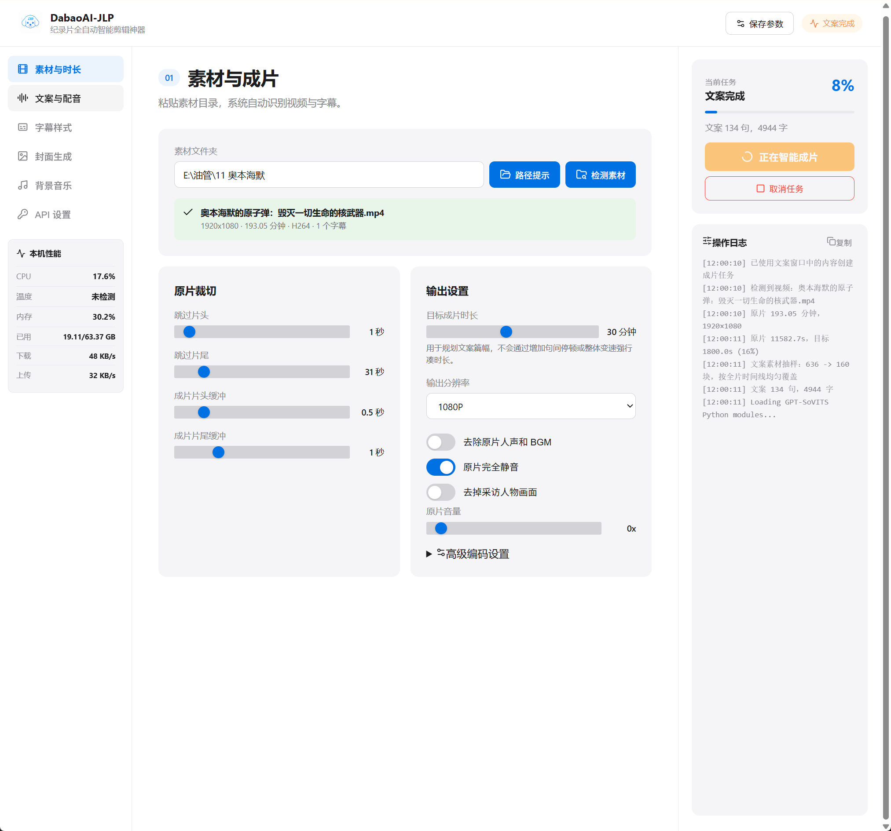
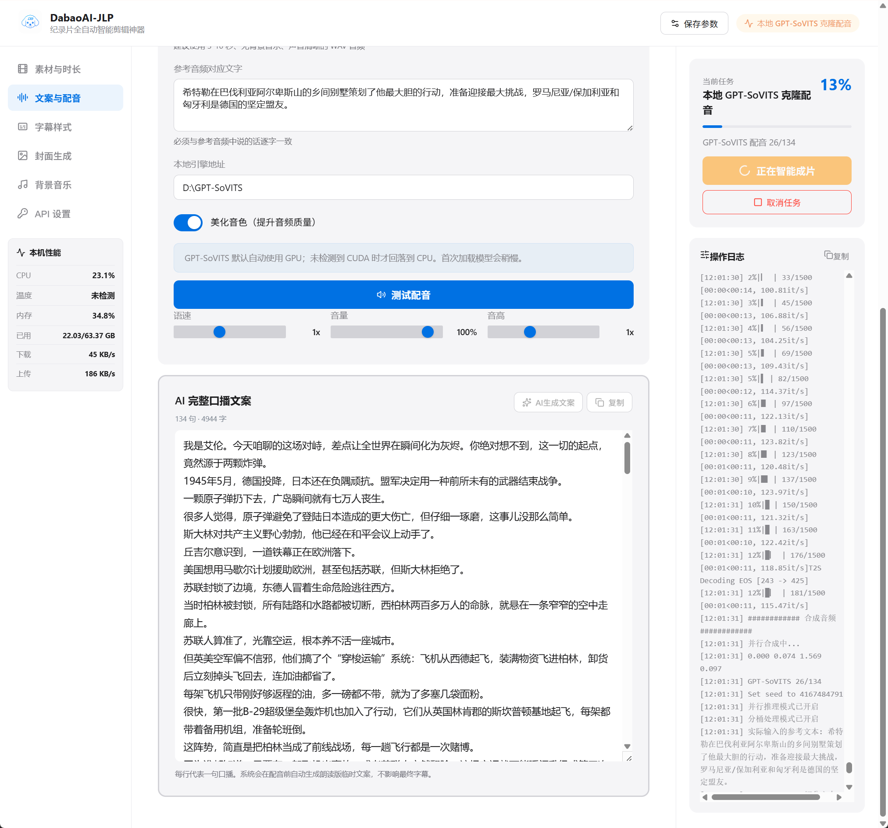
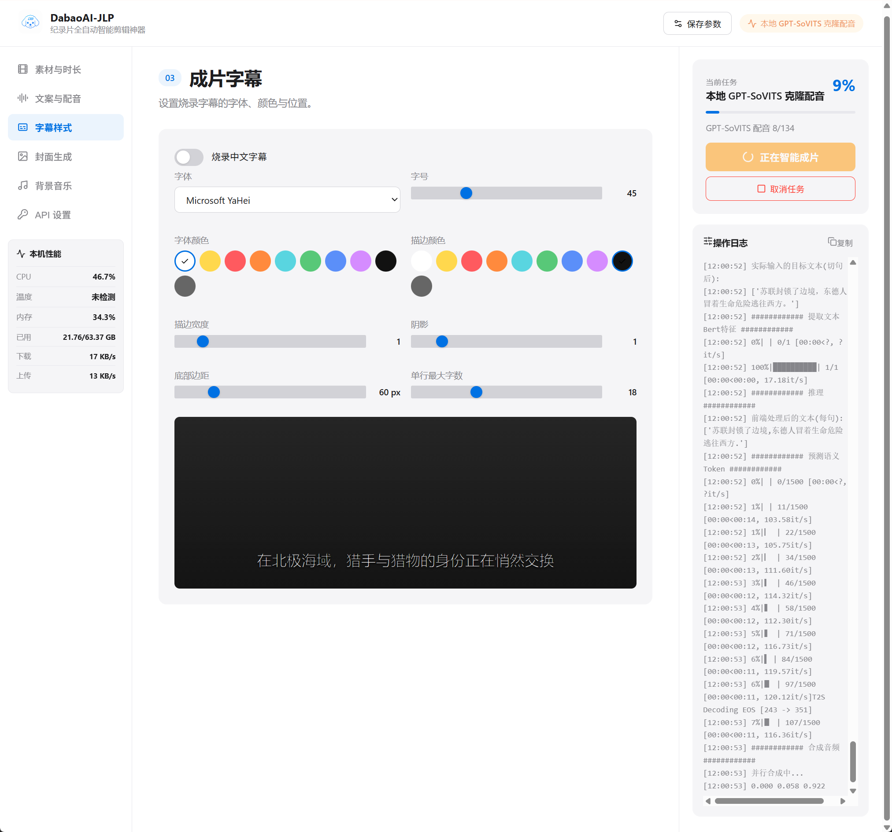
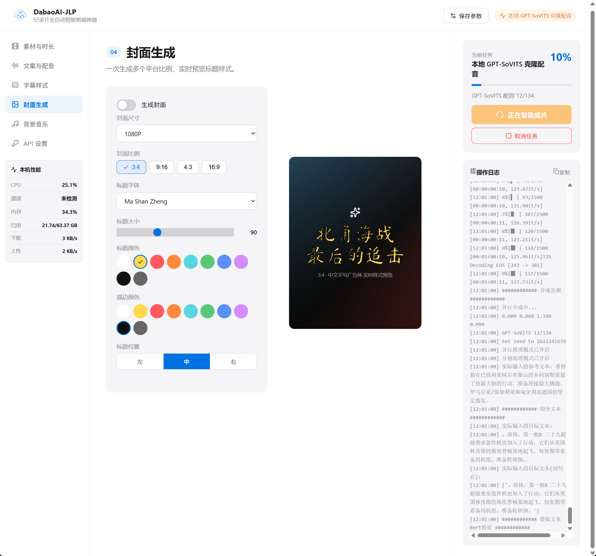
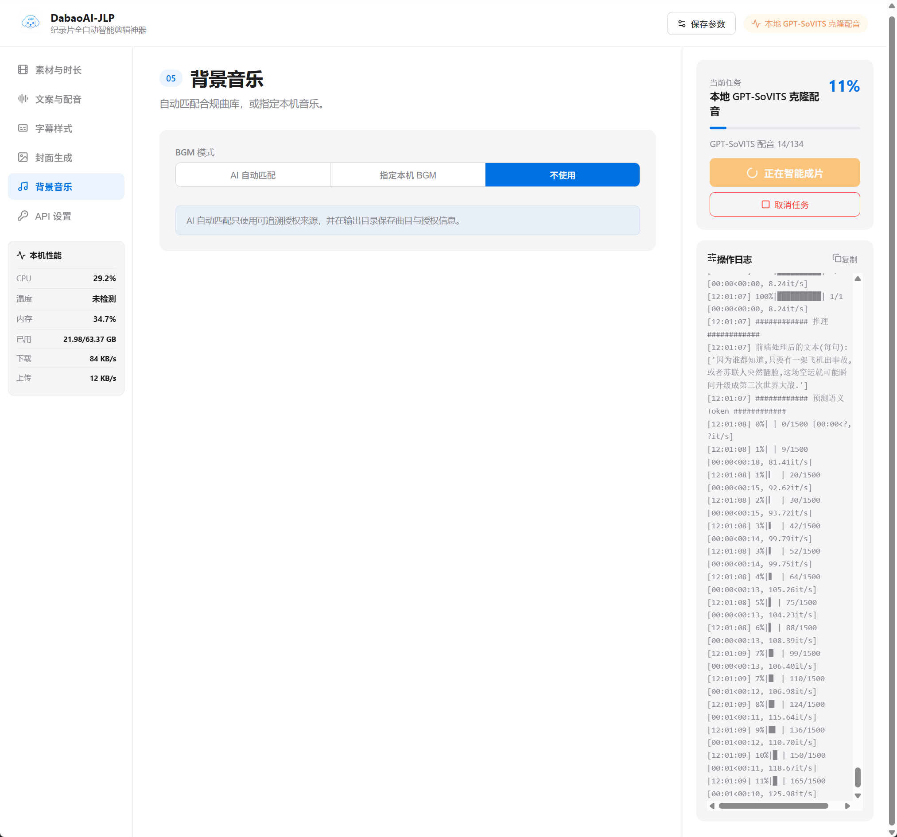
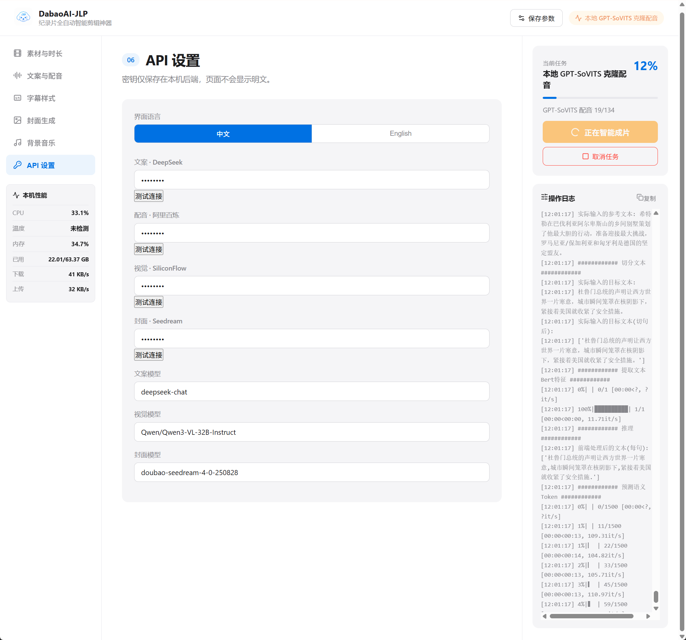
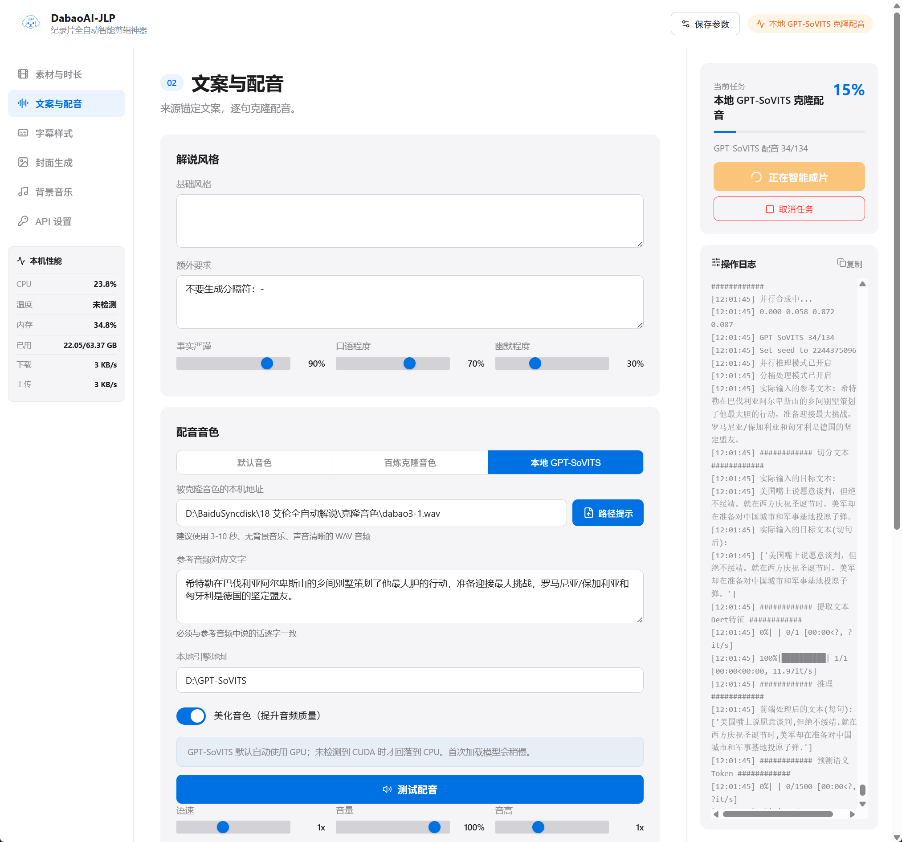

# DabaoAI-JLP: AI Documentary Video Generator and Automated Editing WebUI

**DabaoAI-JLP** is a local-first AI documentary production suite for creators who want to turn raw documentary footage, subtitles, narration ideas, voice settings, subtitles, covers, and publishing copy into a complete edited video workflow.

It combines a FastAPI backend, a Vite React WebUI, source-grounded narration generation, voice synthesis, subtitle styling, cover generation, background music matching, FFmpeg rendering, and publishing metadata generation in one desktop-friendly tool.

> Default WebUI language: English  
> Creator and contributor: Dabao

## Screenshots

<p align="center">
  
  
  
  
  
  
  
</p>

## Keywords

AI documentary generator, AI video editing, automatic documentary editing, narration generator, documentary script AI, AI voiceover, GPT-SoVITS WebUI, FastAPI video pipeline, FFmpeg automation, subtitle burn-in, AI cover generator, creator tools.

## Highlights

- Local WebUI for documentary production and batch video processing
- AI narration script generation grounded in source subtitles and video timing
- Multiple voice options: DashScope/Bailian voices, cloned voice IDs, or local GPT-SoVITS
- FFmpeg-based video assembly with subtitle burn-in and output presets
- Cover generation controls for common platform ratios
- Background music workflow with local or AI-matched tracks
- Publication helper that generates title, tags, and description
- API keys stay local in `.env` or encrypted local config and are ignored by Git

## Tech Stack

- Backend: Python 3.10+, FastAPI, Pydantic, DashScope SDK, Pillow, NumPy, psutil
- Frontend: React, TypeScript, Vite, lucide-react
- Media: FFmpeg and FFprobe
- Optional local voice engine: GPT-SoVITS

## Requirements

- Windows 10/11 is recommended
- Python 3.10 or newer
- Node.js 18 or newer
- FFmpeg and FFprobe available in `PATH`, or placed under `tools/ffmpeg/bin`
- API keys for the providers you enable:
  - `DEEPSEEK_API_KEY` for narration and publishing copy
  - `DASHSCOPE_API_KEY` for Bailian/Qwen voice synthesis
  - `SILICONFLOW_API_KEY` for visual analysis
  - `SEEDREAM_API_KEY` for cover generation

## Quick Start

1. Clone the repository.

```bash
git clone https://github.com/<your-name>/DabaoAI-JLP-AI-Documentary-Generator.git
cd DabaoAI-JLP-AI-Documentary-Generator
```

2. Create your local environment file.

```bash
copy .env.example .env
```

3. Fill in the API keys you need in `.env`.

```env
DEEPSEEK_API_KEY=your_deepseek_key
DASHSCOPE_API_KEY=your_dashscope_key
SILICONFLOW_API_KEY=your_siliconflow_key
SEEDREAM_API_KEY=your_seedream_key
```

4. Install FFmpeg.

Either add FFmpeg to `PATH`, or place `ffmpeg.exe` and `ffprobe.exe` here:

```text
tools/ffmpeg/bin/
```

5. Start the WebUI.

```bat
start_dabaoai.bat
```

The first launch installs frontend and Python dependencies, builds the WebUI, starts the local backend, and opens:

```text
http://127.0.0.1:7860
```

## Manual Installation

```bash
python -m pip install -r requirements.txt
npm --prefix frontend install
npm --prefix frontend run build
python launch_dabaoai.py
```

## Runtime Check

```bash
python check_deps.py
```

This checks Python, Node.js, FFmpeg, Python packages, and local API key availability.

## Using GPT-SoVITS

GPT-SoVITS is optional. To use it:

1. Install GPT-SoVITS locally.
2. Set these values in `.env` or the WebUI:

```env
GPT_SOVITS_ENGINE=C:\path\to\GPT-SoVITS
GPT_SOVITS_REFERENCE_AUDIO=C:\path\to\reference.wav
DABAOAI_START_GPT_SOVITS=1
```

3. In the WebUI, choose **Local GPT-SoVITS** under **Script & Voice**.

## Typical Workflow

1. Put source footage and subtitle files in one folder.
2. Paste the source folder path into the WebUI.
3. Detect media and set target duration.
4. Generate or edit the narration script.
5. Choose voice, subtitle style, cover settings, and BGM.
6. Start video creation.
7. Copy the generated publishing title, tags, and description.

## Project Structure

```text
backend/                 FastAPI support modules, settings, jobs, media tools
frontend/                React + TypeScript WebUI
anchored_pipeline.py     Source-grounded narration and rendering pipeline
bbc_mp4_pipeline.py      Legacy/full pipeline utilities
gpt_sovits_batch.py      Batch TTS helper for local GPT-SoVITS
scene_matcher.py         Scene matching helpers
launch_dabaoai.py        Local server launcher
start_dabaoai.bat        Windows one-click launcher
config.json              Public, no-secret default pipeline config
.env.example             Local API key template
```

## Security Notes

- Do not commit `.env`, `config/secrets.bin`, `config/.secret.key`, `runtime/`, generated videos, logs, or local task files.
- This release intentionally excludes local runtime outputs, node modules, FFmpeg binaries, API keys, encrypted secrets, and task artifacts.
- API keys are read from `.env`, system environment variables, or the local encrypted config created by the WebUI.

## Contributor

Dabao
